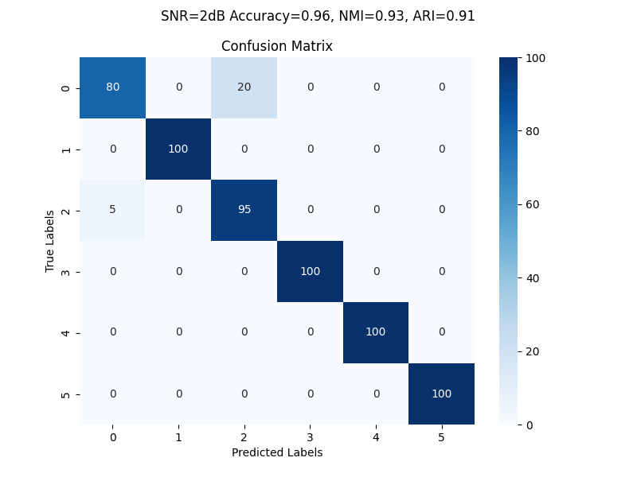

## 说明：
这个仓库是我fork的，现在进行代码解读。
## 分析 
### /radar/generate.m
可以看到是数据生成,且存储方式是连续存放。  
    连续关系1-1000是CW，1001:2000为LFM，2001:3000为BPSK, 3001:4000为FSK， 4001:5000为NLFM， 5001:6000为LFM/NLFM  
    每种具有两种不同信噪比分别存储radar/material/t1/或t2中  
    为什么论文中要说复制三份到三个RGB，因为数据存放成了PNG格式，方便查看。  
使用MSST_Y.m生成需要的时频图，但还提供了MSST_Y_new.m；其区别暂时先搁置；  
### /dataset.py  
常规定义数据集读取方式，不用改。  
数据送入是成对送入的,比如./data/TFIs30_10  
那最后的下采样模型的训练就是没写呗?  
### main.py
有完整的特征提取网络部分的训练方法,以及写好的流程,  
而下采样的训练没有写道main函数中  
### config.py
所有网络的参数定义,以及特征提取网络的检查点等设置  
### model.py
Model使用ResNet骨架作为特征提取网络  
DownStreamModel使用孪生网络作为特征向量的分类判决  
D写的很妙,且作为Model的损失函数  
#### D
D模型在计算传入的p,z的方向相似性，是个损失函数对应原文公式(13).且仅更新p所在的网络.  
#### Model
使用ResNet50取出最后一层FC作为backbone,定义投影头根据参数设置隐藏层大小及输出大小,从特征提取到投影输出  
其中还定义了prediction  
最为精彩的是此模型前向传播的定义,第一次感受到深度学习模型定义的灵活性.  
### /radar/generate.m
这里问题似乎很多,原论文使用的是硬件模拟的方式,我怀疑这里有问题.  
首先不满足采样定理,且载波频率定义复杂,最终也不对.  
其次是代码意图使用几组随机固定的SNR,但代码实际上几乎与定义的noise无关.  
要不自己写吧.这里放一下原文:
```raw paper - Experiments and results discussion
The proposed method is used to classify the measured signals. The
universal software radio peripherals(USRPs) are used to measure the
signals from 6 transmitters. The modulations are CW, LFM, NLFM,
2FSK, BPSK, and LFM/NLFM. For each signal source, 1200 signals are
received and processed. For the MLP, the predictor, and the downstream 
classifier, there is 1 input layer, 1 hidden layer and 1 output
layer. For the projector, there is 1 input layer, 2 hidden layer, and
1 output layer. There are BN layer and ReLU after each layer except
the output layer. For the contrastive learning and the downstream
classifier, the learning rates are 0.01 and 0.001, respectively.
```
自己重写了CW用python实现部分,发现问题,30长的窗10次迭代,输出200*400尺寸大小,但MATLAB用png存储却成了875*656  
其中NLFM部分,不太好复用我已有代码现进行合理的推导:  
```MATLAB
Sig = sin(2*pi*fc*U1(i-4000)*t - pi*U2(i-4000)*k0*sin(1.5*t));  
```
对上式中的相位进行求导有:  $2\pi f_c U_1 - 1.5\pi U_2 \cos(1.5t)$  
故在一个脉冲之间要明显的看到频率的起伏需要参数1.5修改为1e6的数量级  
### /radar/MSST_Y.m
我认为我需要给他改一改,写的真拉.这是在防止我看懂吗?  
这应该是个大工作量了, 暂时计划放弃了.时间不够  

额,我竟然找到了MSST_Y作者的文件,[MATLAB_Exchange](https://ww2.mathworks.cn/matlabcentral/fileexchange/68571-multisynchrosqueezing-transform)  
那这是谁的问题??  
不用多说,我还是知识浅薄了  
用DeepSeek生成一个吧  
### filter.py
这里面就是一个对TFIs的滤波后展示  
作用是什么?  我生成的图带进去是黑的......  
### kmeans.py  
经分析发现它的网络结构是特征提取的骨架输出展平(squeeze)后,  
仔细观察:kmeans仅使用原始TFIs数据直接聚类,  
kmeans_repr是使用特征提取网络输出向量进行的聚类  
同时: 明确了没有MLP,也没有用特征提取网络的投影层  
### linear_mlp.py  
这个文档,写的乱七八糟,虽然加载了特征提取的参数,但没有送入使用.  
送入的反而是一个未训练的ResNet50,还有,我发现,他的MLP连在了特征提取后面  
但代码写的不对,resnet_model反而送进去了个空的  
已经可以证明,我对论文的理解,加上自己的推测应该是正确的  
但现在还是不敢确定,为什么下采样分类器不加原始的投影层  
### linear_sl.py  
这个文档似乎是mlp的修复,没有上面文档的连接错误  
不对,还有错误,model加载的参数没用  
其中它又引入ResNet 但是pretrained=False
而且可以清晰明确的确定,当前我在model中更改的模型是仅仅增加了投影层  
### linear_ssl.py  
这个反而使用了simsiam  
### linear_t.py
ResNet:pretrained=True
## 我的修改issue

### 20250403
现在基本上确定了一个正常的训练流程,不如先在r2上绘制出一个混淆矩阵 有混淆矩阵可以大致判断当前模型的性能  
再看其论文,我需要一个新的区分各个信噪比的数据集  
然后在这些相应的数据集上计算混淆矩阵以及准确率  
tmd 不想干了  
  
SNR=2上图  
  
SNR=-4上图  
  
SNR=-6上图  

### 20250404  
现在知道问题所在了  
并且终于发现BPSK信号的错误  
md,气炸了,还真是我写错了  
现在直接重新覆盖BPSK部分,但是模型需要重新训练  
那么此时可以完全确定的是信号没有大问题,特征提取部分没问题  
信号部分可能存在线性调制,非线性和他俩都有的情况在低信噪比情况下不佳  
后续网络的话,谨慎训练,多想  
无所为,想的同时之前的代码直接训练看效果  辅助我的thinking  

今日结果:  
  
SNR=2上图  
  
SNR=-4上图  
  
SNR=-6上图  

似乎效果也怎么提升,分析问题,可以发现,就是无噪情况下,  
有可能信号随机生成的时候这个码元会一致,导致和固定载波一样  
